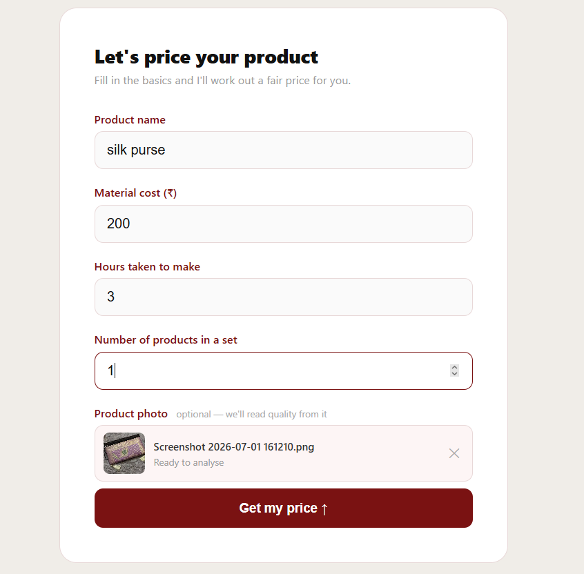
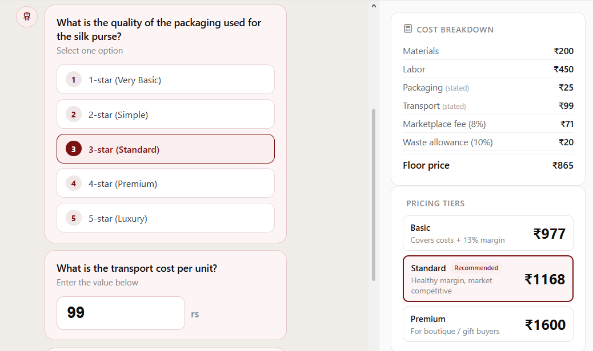
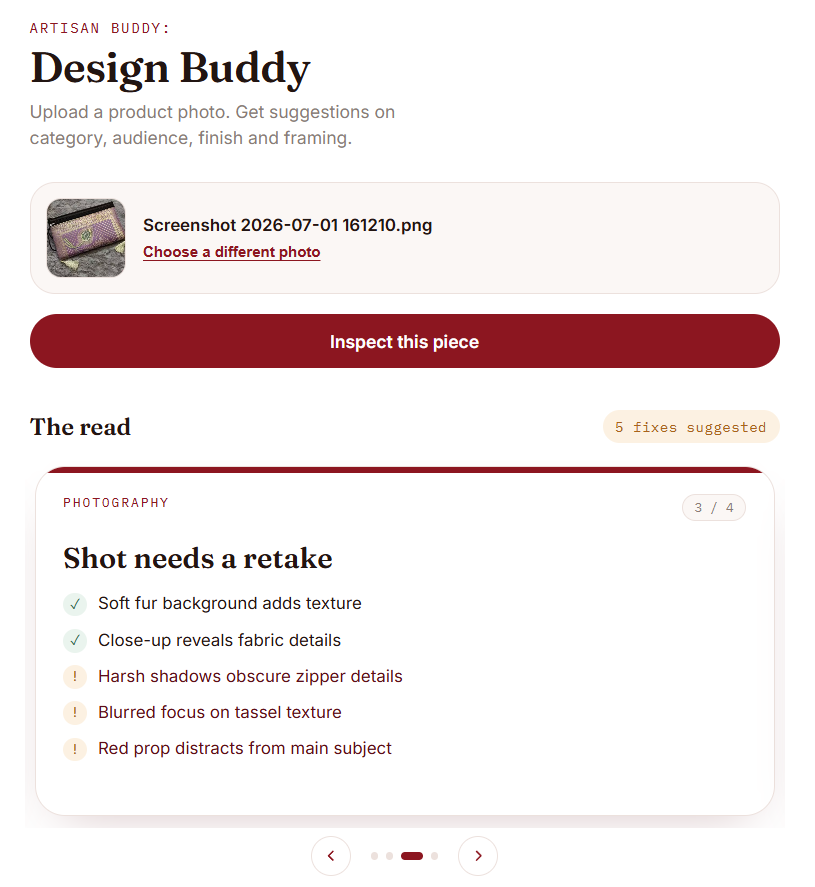

# Artisan Buddy

> AI-powered pricing and listing assistant for artisans.

Price Buddy helps artisans estimate fair selling prices using AI reasoning, semantic search, and real marketplace data. It also reviews product photos and provides actionable design feedback before products are listed for sale.

---

## Features

### Price Buddy

- AI-assisted price estimation from natural language product descriptions
- Estimates material cost, labor effort, and pricing rationale
- Uses Retrieval-Augmented Generation (RAG) to compare similar marketplace products
- Interactive chat for refining pricing recommendations and follow-up questions

<p align="center">
  
  
</p>

---

### Design Buddy

- AI-powered product image analysis
- Reviews photography quality and product presentation
- Evaluates craftsmanship, target audience, and listing readiness
- Provides practical suggestions to improve product listings

<p align="center">
  
</p>

---

## Highlights

- Built a custom Retrieval-Augmented Generation (RAG) pipeline from scratch.
- Created a marketplace knowledge base using **1,400+ real marketplace products**.
- Automatically retrieves product information directly from the Marketplace API.
- Enriches marketplace data with AI-generated categories, materials, and searchable keywords.
- Uses Sentence Transformers and ChromaDB for semantic similarity search.
- Combines retrieved marketplace examples with LLM reasoning to generate explainable, market-aware price recommendations.
- Supports multimodal product evaluation through image analysis and design feedback.

---

## Tech Stack

| Layer | Technology |
|--------|------------|
| LLM | Qwen3-32B via Groq |
| Vision Model | Qwen3.6-27B via Groq |
| Embeddings | Sentence Transformers (`all-MiniLM-L6-v2`) |
| Vector Database | ChromaDB |
| Backend | FastAPI |
| Database | SQLite |
| Frontend | HTML, CSS, JavaScript |

---

## System Architecture

```text
                    User Input
               ┌─────────┴─────────┐
               ▼                   ▼
      Product Description     Product Image
               │                   │
               ▼                   ▼
     Sentence Transformers     Vision Model
               │                   │
               ▼                   ▼
       ChromaDB Marketplace     Design Analysis
            Retrieval                 │
               │                      │
               └──────────┬───────────┘
                          ▼
                   Qwen3-32B Reasoning
                          │
                          ▼
      Price Recommendation + Market Comparison +
             Product Feedback & Explanation
```

---

## Running Locally

```bash
# Backend
cd backend

python -m venv venv
.\venv\Scripts\Activate.ps1

pip install -r requirements.txt

uvicorn main:app --reload --port 8080

# Frontend
cd frontend
python -m http.server 3000
```

Backend → `http://localhost:8080`

Frontend → `http://localhost:3000`

API Docs → `http://localhost:8080/docs`

---

## API

| Method | Endpoint | Description |
|---------|----------|-------------|
| POST | `/analyze` | Complete AI pricing analysis |
| POST | `/market-research` | Marketplace comparison only |
| POST | `/chat` | Continue an existing pricing session |
| POST | `/design-analyze` | Product image analysis |
| POST | `/market-index/build` | Rebuild marketplace knowledge base |
| GET | `/history` | Retrieve previous sessions |
| GET | `/health` | Health check |

---

## Future Improvements

- Support multiple marketplace sources for broader price comparisons.
- Personalized pricing based on artisan experience and region.
- Automatic material detection from uploaded product images.
- Market trend tracking and demand forecasting.
- Export pricing reports for sellers and businesses.