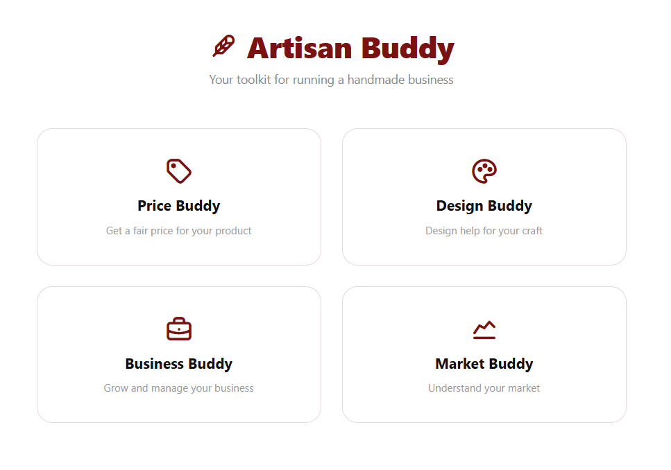
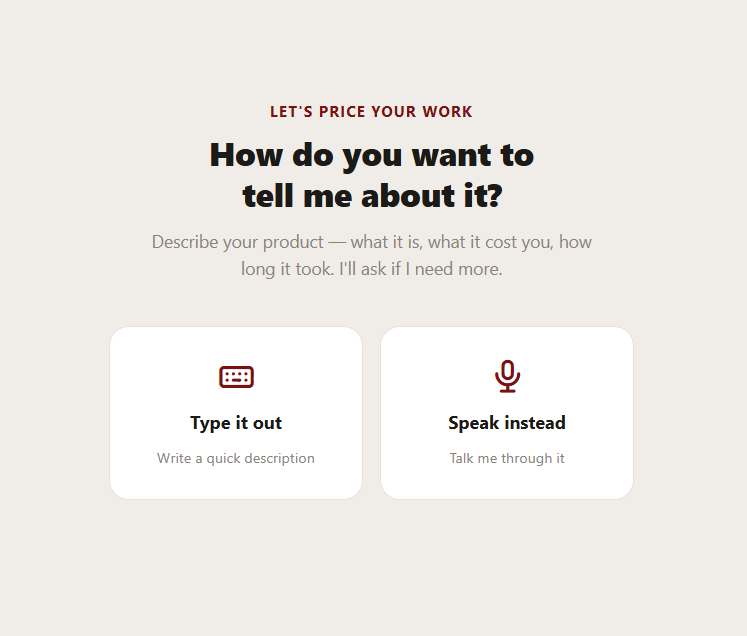
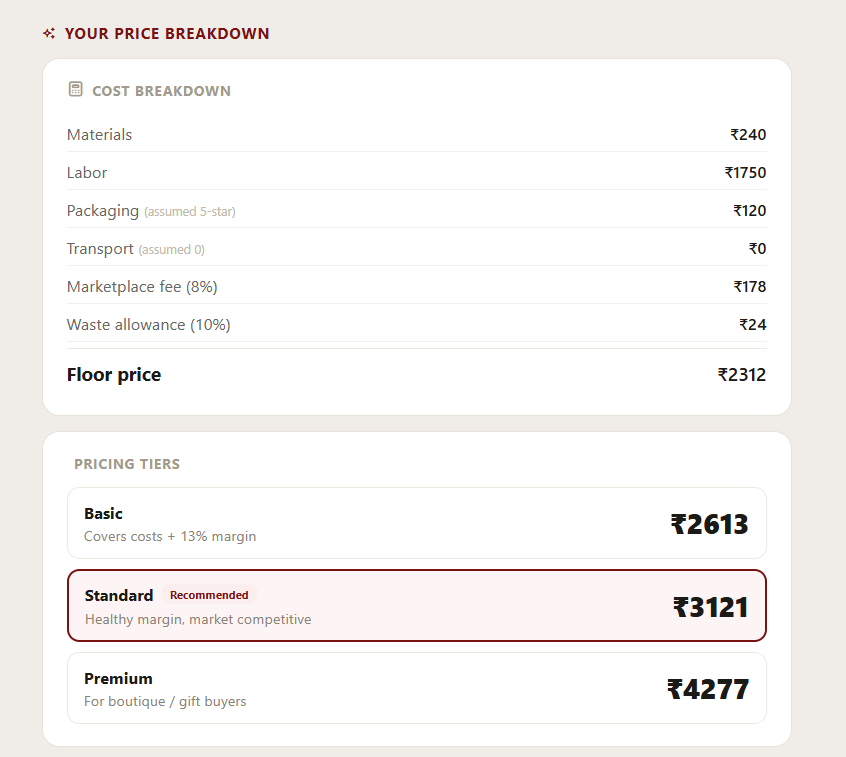
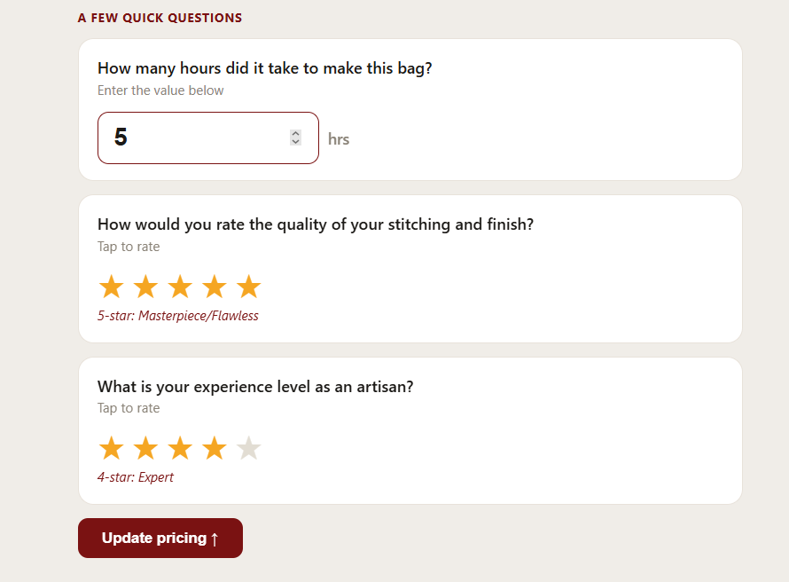
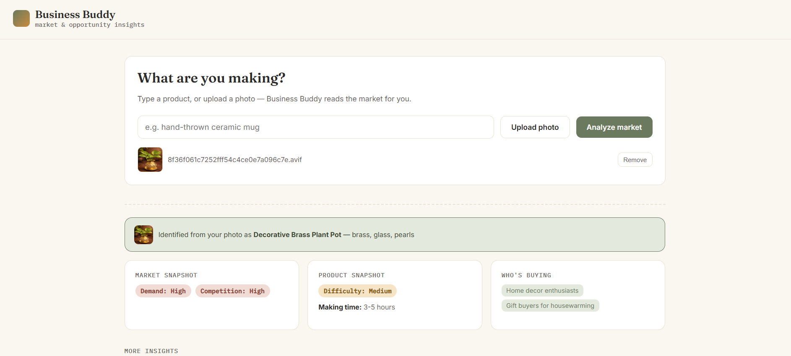
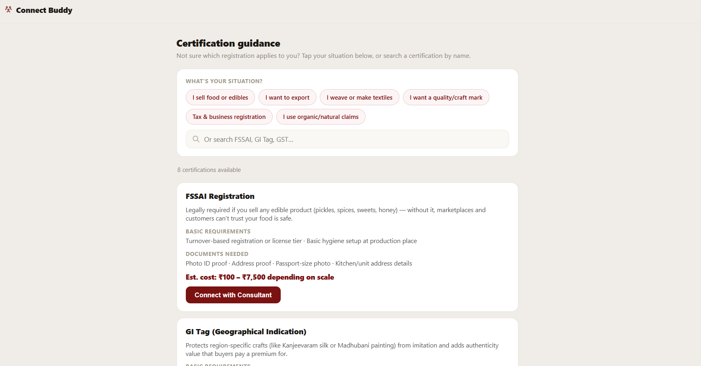

# Artisan Buddy

> AI-powered pricing, listing, and market insight assistant for artisans.

Artisan Buddy helps artisans estimate fair selling prices using AI reasoning, semantic search, and real marketplace data. It reviews product photos and provides actionable design feedback, surfaces market and opportunity insights for new product ideas, and connects artisans with experts, certifications, collaborators, and local communities.

<p align="center">
  
</p>

---

## Features

### Price Buddy

- AI-assisted price estimation from natural language product descriptions
- Estimates material cost, labor effort, and pricing rationale
- Uses Retrieval-Augmented Generation (RAG) to compare similar marketplace products
- Interactive chat for refining pricing recommendations and follow-up questions

<p align="center">
  
</p>

<p align="center">
  
  
</p>

---

### Design Buddy

- AI-powered product image analysis
- Reviews photography quality and product presentation
- Evaluates craftsmanship, target audience, and listing readiness
- Provides practical suggestions to improve product listings

<p align="center">
  
</p>

---

### Business Buddy

- Market and opportunity insights for a product idea — from a typed description or a photo
- Demand and competition snapshot, best-selling seasons, and crafting difficulty at a glance
- Target audience and buying motivation breakdown
- Similar products, business opportunities, risks, and marketing ideas, expandable on demand
- Photo upload path uses the vision model to identify the product before running the analysis

<p align="center">
  
</p>

---

### Connect

- AI-classified "Ask Connect Buddy" search — describe a problem in plain language and it's matched to the right resource type (expert, certification, collaboration, or community)
- **Experts** — browse or filter consultants for pricing, photography, exports, marketing, packaging, marketplace setup, and logistics; request a consultation directly
- **Certifications** — plain-language guidance on registrations like FSSAI, GI Tag, and GST, with requirements, documents needed, and estimated cost; connect with a consultant
- **Collaborate** — matches complementary artisans (e.g. a candle maker with a packaging specialist) and sends a smart, pre-filled introduction message
- **Communities** — find and join local artisan groups by region, city, or language

<p align="center">
  
</p>

---

## Highlights

- Built a custom Retrieval-Augmented Generation (RAG) pipeline from scratch.
- Created a marketplace knowledge base using **1,400+ real marketplace products**.
- Automatically retrieves product information directly from the Marketplace API.
- Enriches marketplace data with AI-generated categories, materials, and searchable keywords.
- Uses Sentence Transformers and ChromaDB for semantic similarity search.
- Combines retrieved marketplace examples with LLM reasoning to generate explainable, market-aware price recommendations.
- Supports multimodal product evaluation through image analysis and design feedback.
- Business Buddy extends the same vision pipeline to turn a product photo directly into market insights.

---

## Tech Stack

| Layer | Technology |
|--------|------------|
| LLM | Qwen3-27B via Groq |
| Vision Model | Qwen3.6-27B via Groq |
| Embeddings | Sentence Transformers (`all-MiniLM-L6-v2`) |
| Vector Database | ChromaDB |
| Backend | FastAPI |
| Database | SQLite |
| Frontend | HTML, CSS, JavaScript |

---

## System Architecture

```text
                    User Input
               ┌─────────┴─────────┐
               ▼                   ▼
      Product Description     Product Image
               │                   │
               ▼                   ▼
     Sentence Transformers     Vision Model
               │                   │
               ▼                   ▼
       ChromaDB Marketplace     Design Analysis /
            Retrieval          Business Insights
               │                      │
               └──────────┬───────────┘
                          ▼
                   Qwen3-27B Reasoning
                          │
                          ▼
      Price Recommendation + Market Comparison +
        Product Feedback + Business Insights
```

---

## Running Locally

```bash
# Backend
cd backend

python -m venv venv
.\venv\Scripts\Activate.ps1

pip install -r requirements.txt

uvicorn main:app --reload --port 8080

# Frontend
cd frontend
python -m http.server 3000
```

Backend → `http://localhost:8080`

Frontend → `http://localhost:3000`

API Docs → `http://localhost:8080/docs`

---

## API

| Method | Endpoint | Description |
|---------|----------|-------------|
| POST | `/analyze` | Complete AI pricing analysis |
| POST | `/market-research` | Marketplace comparison only |
| POST | `/chat` | Continue an existing pricing session |
| POST | `/design-analyze` | Product image analysis |
| POST | `/business-buddy/analyze` | Market and opportunity insights from a product description |
| POST | `/business-buddy/analyze-image` | Market and opportunity insights from a product photo |
| GET | `/connect/bootstrap` | Load experts, certifications, collaborators, and communities |
| POST | `/connect/analyze` | Classify a free-text question and match it to experts, certifications, collaborations, or communities |
| POST | `/connect/request-consultation` | Request a consultation with an expert |
| POST | `/connect/connect-certification-consultant` | Connect with a certification consultant |
| POST | `/connect/join-community` | Join a local artisan community |
| POST | `/connect/send-introduction` | Send an introduction message to a potential collaborator |
| POST | `/market-index/build` | Rebuild marketplace knowledge base |
| GET | `/history` | Retrieve previous sessions |
| GET | `/health` | Health check |

---

## Future Improvements

- Support multiple marketplace sources for broader price comparisons.
- Personalized pricing based on artisan experience and region.
- Automatic material detection from uploaded product images.
- Market trend tracking and demand forecasting.
- Export pricing reports for sellers and businesses.